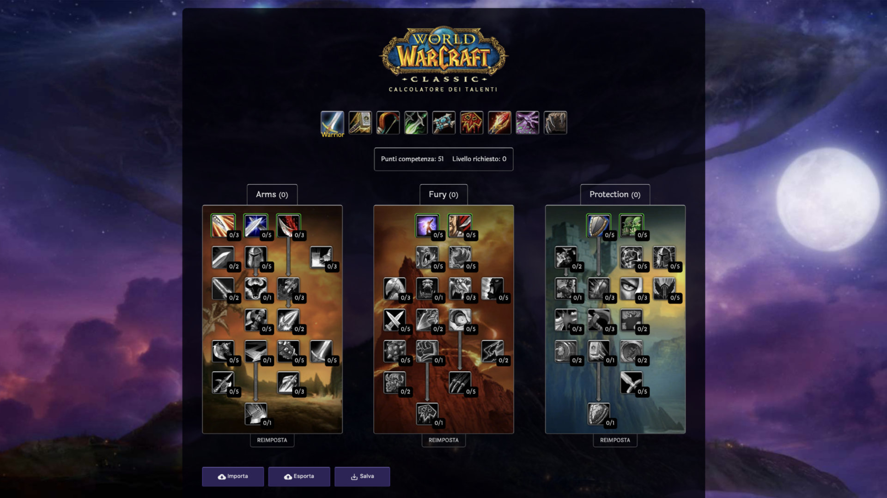

# Classic WoW Talent Planner / Talent Calculator
A talent planner / talent calculator for World of Warcraft Classic\
~~forked from hseager/Classic-WoW-Talent-Planner~~\
forked from iamadagostino/Classic-WoW-Talent-Planner

## Features
* All classes and talent trees with data
* Save with local storage
* Import/Export with base64 encoding
* Supports mobile devices
* Keeps track of talent path
* Translated back to English (disregard the old screenshot)

## To build
* Clone the repository
* Install [vue-cli](https://cli.vuejs.org/) | npm install -g vue-cli
* Run "npm install"
* To start local development run "npm run serve"
* To start local production run "npm run build"
